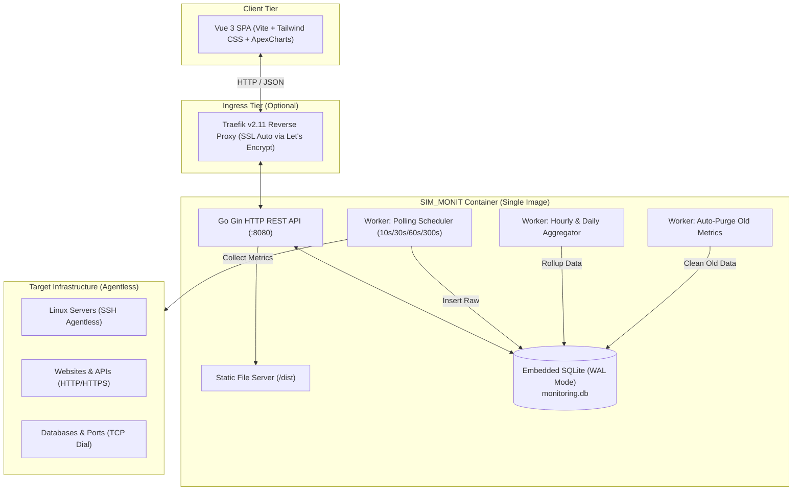

# ⚡ SIM_MONIT — Server & Service Monitoring Engine

<p align="center">
  
  
  
  
  
  
  
</p>

<p align="center">
  <b>Aplikasi monitoring server, website, API, dan database yang ultra-ringan, cepat, dan agentless.</b><br>
  Dibangun dengan arsitektur <i>Single Multi-Stage Container</i>: Backend Go bertenaga tinggi + Embedded SQLite (WAL) + Frontend Vue 3 Dark Slate Dashboard yang memanjakan mata.
</p>

---

## 📑 Daftar Isi

- [✨ Fitur Utama](#-fitur-utama)
- [🏗️ Arsitektur Sistem](#️-arsitektur-sistem)
- [📂 Struktur Direktori](#-struktur-direktori)
- [⚙️ Environment Variables](#️-environment-variables)
- [🚀 Cara Menjalankan — Non-Docker (Local Dev & Build)](#-cara-menjalankan--non-docker)
  - [Opsi A: Mode Development (Hot-Reload)](#opsi-a-mode-development-hot-reload-rekomendasi-dev)
  - [Opsi B: Mode Standalone Single Binary (Production Local)](#opsi-b-mode-standalone-single-binary)
- [🐳 Cara Menjalankan — Docker](#-cara-menjalankan--docker)
  - [Opsi 1: Docker Compose dengan Traefik (Production VPS)](#opsi-1-docker-compose-dengan-traefik-production-vps)
  - [Opsi 2: Docker Standalone (Direct Port Binding)](#opsi-2-docker-standalone-direct-port-binding)
- [📡 API Reference](#-api-reference)
- [🔧 Troubleshooting & Tips](#-troubleshooting--tips)

---

## ✨ Fitur Utama

- 🕵️ **100% Agentless Monitoring**:
  - **Linux Server via SSH**: Monitoring CPU %, RAM %, Disk usage %, Bandwidth, dan load average tanpa perlu install agent pihak ketiga di server target.
  - **Website & REST API**: HTTP/HTTPS latency breakdown presisi (DNS Lookup, TCP Connect, TLS Handshake, TTFB, Content Download) dan status code checking.
  - **Database & TCP Service**: Pengecekan port live (PostgreSQL, MySQL, Redis, SSH, Custom port).
- 💾 **Embedded SQLite + Zero Overhead**:
  - Menggunakan driver murni Go (`modernc.org/sqlite`) tanpa ketergantungan CGO.
  - Dioptimasi dengan `PRAGMA journal_mode=WAL;` dan `PRAGMA busy_timeout=5000;` agar pembacaan dan penulisan concurrent berjalan mulus tanpa lock.
  - Konsumsi memori sangat minim (**< 256 MB RAM**).
- 📈 **Smart Metrics Retention & Auto-Aggregator**:
  - **Raw Metrics** (`metrics_raw`): Data interval detik, retention 7 hari (auto-purge otomatis via background worker).
  - **Hourly Metrics** (`metrics_hourly`): Agregasi per 1 jam, retention 90 hari.
  - **Daily Metrics** (`metrics_daily`): Agregasi harian untuk analisa tren jangka panjang (YTD / All-time).
- 🖥️ **Sleek Cyber Dark UI**:
  - Antarmuka modern dengan Tailwind CSS Slate theme & Lucide icons.
  - Real-time heartbeat pulse indicator (Hijau = UP, Kuning = Warning, Merah = Critical/Down).
  - Grafik interaktif ApexCharts dengan kurva bezier halus, multi-layer stacked area, dan mode toggle.
  - Filter rentang waktu cepat: `1H`, `24H`, `7D`, `MTD`, `YTD`, serta custom date range picker.
- 🔐 **Enterprise Secure Coding Standard**:
  - **SQL Injection Prevention**: 100% prepared statements dengan validasi whitelist pada seluruh parameter query.
  - **OWASP Security Headers**: `X-Frame-Options: DENY`, `X-Content-Type-Options: nosniff`, `X-XSS-Protection`, Content Security Policy (CSP), dan Referrer-Policy.
  - **IDOR Protection**: Validasi kepemilikan target ketat di level middleware dan controller pada metrik dan analitik.
  - **DDoS & Brute-Force Rate Limiting**: In-memory rate limiter per IP untuk API (120 req/menit) dan proteksi login/register (10 req/menit).
  - **CORS Whitelist & Safe Credentials**: Mencegah *arbitrary origin reflection* dengan daftar origin terverifikasi.
  - **Credential Masking**: Password dan private key di-mask (`********`) saat dikirim ke browser client.
  - **DoS Body Protection**: Pembatasan payload request (1MB) dan pembatasan pembacaan respon HTTP collector (5MB).

---

## 🏗️ Arsitektur Sistem



---

## 📂 Struktur Direktori

```text
sim_monit/
├── 01_user_flow_dan_breakdown_halaman.txt   # Dokumentasi alur & breakdown halaman
├── 02_detil_halaman_monitoring.txt          # Dokumentasi spesifikasi metrik visual
├── 03_tech_stack_dan_arsitektur.txt         # Dokumentasi arsitektur database & worker
├── 04_docker_dan_deployment_setup.txt       # Panduan Traefik & deployment
├── Dockerfile                               # Multi-stage Docker build (Vue 3 + Go)
├── docker-compose.yml                       # Konfigurasi Docker Compose (Traefik)
├── .env.example                             # Template environment variable
├── main.go                                  # Entry point aplikasi backend
├── go.mod / go.sum                          # Dependensi Golang
├── server/                                  # Source code Backend (Go)
│   ├── collector/                           # Collector: SSH, HTTP, & TCP agentless
│   ├── config/                              # Parser environment config
│   ├── db/                                  # SQLite connection & WAL schema migration
│   ├── handlers/                            # Controller HTTP (Auth, Target, Metric)
│   ├── middleware/                          # JWT Authentication middleware
│   ├── models/                              # Model & struct database
│   ├── routes/                              # Routing Gin REST API & SPA fallback
│   └── worker/                              # Scheduler, Aggregator, & Purger background
└── frontend/                                # Source code Frontend (Vue 3)
    ├── package.json                         # Dependensi Vite, Vue, Tailwind, Pinia
    ├── vite.config.js                       # Konfigurasi proxy dev server ke port 8080
    ├── tailwind.config.js                   # Tema Dark Slate UI
    └── src/
        ├── views/                           # LoginView, RegisterView, DashboardView
        ├── components/                      # StatCard, ChartArea, TargetModal, dll
        ├── stores/                          # State management Pinia (Auth, Target, UI)
        └── router/                          # Vue Router & Auth Guards
```

---

## ⚙️ Environment Variables

Salin file `.env.example` menjadi `.env`:

```bash
cp .env.example .env
```

| Variabel | Default | Keterangan |
| :--- | :--- | :--- |
| `PORT` | `8080` | Port tempat backend Go listen |
| `DB_PATH` | `./monitoring.db` | Path file database SQLite lokal |
| `JWT_SECRET` | `super_secret_...` | Kunci rahasia untuk enkripsi token JWT |
| `STATIC_DIR` | `./frontend/dist` | Lokasi folder build frontend Vue yang diserve oleh Go |
| `GIN_MODE` | `debug` | Mode Gin: `debug` untuk dev lokal, `release` untuk production |
| `ALLOWED_ORIGINS` | `http://localhost:3000,...` | Whitelist domain CORS yang diizinkan mengakses API (dipisahkan koma) |

---

## 🚀 Cara Menjalankan — Non-Docker

### Prasyarat:
- **Go**: versi 1.22 atau lebih baru ([Unduh Go](https://go.dev/dl/))
- **Node.js**: versi 18 atau 20+ ([Unduh Node.js](https://nodejs.org/))

---

### Opsi A: Mode Development (Hot-Reload) [REKOMENDASI DEV]

Pada mode ini, backend Go berjalan di port `8080` dan frontend Vite berjalan di port `3000` dengan fitur hot-reload. Permintaan API dari Vite otomatis di-proxy ke backend Go.

#### 1. Jalankan Backend (Terminal 1):
```bash
# Salin konfigurasi environment
cp .env.example .env

# Unduh dependensi Go
go mod download

# Jalankan server Go
go run main.go
```
> Server backend akan aktif di: `http://localhost:8080`

#### 2. Jalankan Frontend (Terminal 2):
```bash
# Pindah ke direktori frontend
cd frontend

# Install node dependencies
npm install

# Jalankan dev server Vite
npm run dev
```
> Buka browser dan akses dashboard di: **`http://localhost:3000`**

---

### Opsi B: Mode Standalone Single Binary

Pada mode ini, frontend di-build menjadi asset statis terlebih dahulu, kemudian backend Go akan menyajikan API sekaligus UI dashboard secara utuh dalam satu port (`8080`).

#### 1. Build Frontend:
```bash
cd frontend
npm install
npm run build
cd ..
```
Hasil build akan berada di `frontend/dist/`.

#### 2. Jalankan Backend:
```bash
# Pastikan GIN_MODE=release di file .env atau jalankan langsung:
go run main.go
```
Atau kompilasi menjadi file binary mandiri:
```bash
# Linux / macOS:
go build -ldflags="-s -w" -o sim_monit main.go
./sim_monit

# Windows PowerShell:
go build -ldflags="-s -w" -o sim_monit.exe main.go
.\sim_monit.exe
```
> Buka browser dan akses aplikasi langsung di: **`http://localhost:8080`**

---

## 🐳 Cara Menjalankan — Docker

Aplikasi ini menggunakan **Multi-stage Dockerfile** yang sangat efisien:
1. **Stage 1 (Node.js)**: Melakukan compile asset frontend Vue 3.
2. **Stage 2 (Golang)**: Melakukan compile binary Go statis tanpa CGO.
3. **Stage 3 (Alpine Linux)**: Menggabungkan binary dan asset statis ke dalam image final yang sangat ramping dan aman.

---

### Opsi 1: Docker Compose dengan Traefik (Production VPS)

Cocok untuk deployment di server production yang sudah memiliki reverse proxy Traefik v2.11 dengan external network `web`.

1. **Pastikan external network Traefik sudah ada:**
   ```bash
   docker network create web
   ```

2. **Siapkan file database SQLite di host:**
   ```bash
   touch monitoring.db
   chmod 666 monitoring.db
   ```

3. **Sesuaikan domain pada `docker-compose.yml`:**
   Ubah `monitor.siberhub.id` sesuai subdomain atau domain kamu:
   ```yaml
   labels:
     - "traefik.enable=true"
     - "traefik.http.routers.monitoring.rule=Host(`monitor.domainkamu.com`)"
     - "traefik.http.routers.monitoring.entrypoints=websecure"
     - "traefik.http.routers.monitoring.tls.certresolver=myresolver"
   ```

4. **Build & Jalankan Container:**
   ```bash
   docker compose up -d --build
   ```

5. **Periksa Log & Status:**
   ```bash
   docker compose logs -f
   ```

---

### Opsi 2: Docker Standalone (Direct Port Binding)

Jika kamu ingin menjalankan container Docker secara langsung di server lokal atau VPS tanpa Traefik:

#### Menggunakan Docker CLI Langsung:
```bash
# 1. Siapkan file database
touch monitoring.db

# 2. Build image
docker build -t sim_monit:latest .

# 3. Jalankan container dengan mapping port 8080
docker run -d \
  --name sim_monit_app \
  -p 8080:8080 \
  -v $(pwd)/monitoring.db:/app/monitoring.db \
  -v ~/.ssh:/root/.ssh:ro \
  -e JWT_SECRET=ganti_dengan_secret_key_anda \
  --restart unless-stopped \
  sim_monit:latest
```

#### Atau Menggunakan `docker-compose.standalone.yml`:
Buat file `docker-compose.override.yml` atau gunakan snippet berikut:
```yaml
version: '3.8'

services:
  monitoring:
    build: .
    container_name: server_monitoring_app
    restart: unless-stopped
    ports:
      - "8080:8080"
    environment:
      - PORT=8080
      - DB_PATH=/app/monitoring.db
      - JWT_SECRET=kunci_jwt_super_aman_123
      - GIN_MODE=release
    volumes:
      - ./monitoring.db:/app/monitoring.db
      - ~/.ssh:/root/.ssh:ro
```
Jalankan dengan:
```bash
docker compose up -d --build
```
> Akses aplikasi melalui browser: **`http://localhost:8080`** atau **`http://<IP-SERVER>:8080`**

---

## 📡 API Reference

Semua route API dilindungi oleh JWT Middleware kecuali rute publik `/api/auth/*`.

### 🔑 Authentication
| Method | Endpoint | Deskripsi |
| :--- | :--- | :--- |
| `POST` | `/api/auth/register` | Mendaftarkan akun user baru |
| `POST` | `/api/auth/login` | Login user & mendapatkan token JWT |
| `POST` | `/api/auth/logout` | Logout user & invalidasi sesi |
| `GET` | `/api/auth/me` | Mengambil profil user saat ini (Protected) |

### 🎯 Target Management
| Method | Endpoint | Deskripsi |
| :--- | :--- | :--- |
| `GET` | `/api/targets` | Mengambil semua target milik user |
| `POST` | `/api/targets` | Menambahkan target monitoring baru |
| `GET` | `/api/targets/:id` | Mengambil detail target tertentu |
| `PUT` | `/api/targets/:id` | Memperbarui konfigurasi target |
| `DELETE` | `/api/targets/:id` | Menghapus target dan metrik terkait |
| `POST` | `/api/targets/test-connection` | Validasi koneksi target (SSH/HTTP/TCP) sebelum disimpan |

### 📊 Metrics & Analytics
| Method | Endpoint | Query Param | Deskripsi |
| :--- | :--- | :--- | :--- |
| `GET` | `/api/targets/:id/metrics` | `range=1h\|24h\|7d\|mtd\|ytd` | Mengambil titik data chart (raw/hourly/daily) |
| `GET` | `/api/targets/:id/stats` | `range=...` | Mengambil ringkasan statistik (uptime %, avg latency, CPU/RAM peak) |

---

## 🔧 Troubleshooting & Tips

<details>
<summary><b>1. Error: "Database is locked" pada SQLite</b></summary>

Sistem ini secara bawaan telah mengaktifkan mode **WAL (Write-Ahead Logging)**:
```sql
PRAGMA journal_mode=WAL;
PRAGMA busy_timeout=5000;
```
Jika file database di-mount dari host ke dalam container Docker, pastikan permission file `monitoring.db` pada host dapat dibaca dan ditulisi oleh user container (`chmod 666 monitoring.db`).
</details>

<details>
<summary><b>2. Target Server SSH Gagal Konek (Permission Denied)</b></summary>

- Jika menggunakan auth berbasis **SSH Key**, pastikan private key dapat diakses oleh aplikasi (pada Docker, pastikan mount `-v ~/.ssh:/root/.ssh:ro` telah aktif).
- Pastikan user Linux target memiliki permission untuk menjalankan perintah standar: `uptime`, `free -m`, `df -h`, dan `top -bn1`.
</details>

<details>
<summary><b>3. Docker Compose Error: "network web declared as external, but could not be found"</b></summary>

Jika kamu belum menginstal Traefik atau belum membuat network `web`, buat network tersebut terlebih dahulu:
```bash
docker network create web
```
Atau jika ingin menjalankan tanpa Traefik, gunakan [Opsi 2: Docker Standalone](#opsi-2-docker-standalone-direct-port-binding).
</details>

---

<p align="center">
  Dibuat dengan ❤️ untuk monitoring infrastruktur yang ringan, handal, dan estetis.
</p>
